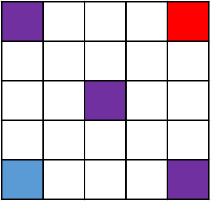

# 王国守卫战比赛规则

## 引言

此文档是"王国守卫战"的规则文档.

## 总述

"王国守卫战"是一款由玩家扮演国王指挥士兵在大陆上与敌人对决的AI策略游戏.
参战双方在同一场地内通过指挥不同种类的士兵争夺旗帜或摧毁敌方基地来获得最终胜利.

## 基本概念

### 士兵

士兵一共有三个, 分别是骑兵、弓兵与步兵, 具体属性见下表:
兵种|攻击力|生命值|攻击范围|移动范围
:-:|:-:|:-:|:-:|:-:
骑兵|400|800||
弓兵|500(攻击步兵时\*2)|300||
步兵|200(攻击基地时\*3)|1800||

### 棋盘(战场)

如下图所示, 战斗场地大小为5\*5的棋盘. 玩家分为红蓝两方, 其中蓝方为先手. 左下角蓝色区块为蓝方基地所在位置, 右上角红色区块为红方基地所在位置. 基地的初始生命值为2000, 双方士兵初始位置如图所示.

### 回合制

比赛采用回合制.  
规定下面的流程是一个回合，游戏开始后, 对战平台会重复执行回合直到游戏结束.  

   1. 先手玩家(蓝)移动一个士兵或者让士兵进攻某个敌方目标.
   2. 对战平台进行盘面状态更新与得分结算.
   3. 后手玩家(红)移动一个士兵或者让士兵进攻某个敌方目标. (注意: 后手玩家会获得刚刚更新的盘面状态与最新的得分情况)
   4. 对战平台进行盘面状态更新与得分结算.

## 具体规则

### 士兵移动规则

参见[士兵属性](#士兵)表格中的"移动范围": 如果玩家希望移动士兵, 则士兵的终止范围必须包含在当前位置(棕色区块)所覆盖的移动范围内(黄色区块), 并且所移动的目标位置不可以存在双方的士兵或基地.

### 士兵攻击规则

参见[士兵属性](#士兵)表格中的"攻击范围": 士兵可以发起的攻击目标包括敌方士兵与基地. 当攻击目标位于士兵当前位置(棕色区块)所覆盖的攻击范围(黄色区块)时, 玩家可以指挥士兵对目标发起攻击, 发起攻击后, 被攻击的目标的生命值会减少发起进攻的士兵的攻击力对应的数值.

### 士兵的死亡与复活规则

当士兵受到攻击后, 如果生命值小于等于零, 则该士兵死亡. 士兵死亡后将被立刻移出棋盘. 另外, 参见[士兵属性](#士兵)表格中的"复活时间": 从士兵死亡后的下个回合开始计数, 当死亡的士兵经历"复活时间"所需的回合数后, 将在下一个回合被重新放入棋盘, 放入的位置为[初始位置](#棋盘战场). 需要注意的是, 如果放入的位置已经有双方的士兵存在, 则该回合士兵无法复活, 直到某一回合开始前放入的位置没有双方的士兵存在, 才可以复活.

### 旗帜的生成规则与奖励分数

旗帜一共有两种, 分别为"绿色旗帜"与"紫色旗帜", 具体信息见下表:
旗帜种类|生成间隔|存在时间|奖励分数|生成位置
:-:|:-:|:-:|:-:|:-:
绿色旗帜|5回合|2回合|10|
紫色旗帜|10回合|1回合|15|

以绿色旗帜为例, 在游戏进行到第1、6、11等回合开始时, 会在相应位置生成, 且在第2、7、12等回合结束时被移出棋盘. 在旗帜存在于棋盘内时, 如果某玩家的士兵移动到了旗帜所在的位置, 则该玩家获得相应的奖励分数且该旗帜被立刻移出棋盘. 玩家获得的奖励分数将被用于进行胜负判定.

### 胜负判定

   1. 若有玩家基地生命值小于等于零, 则直接判负.
   2. 若有玩家进行非法操作, 直接判负. (非法操作包括但不限于: AI返回的士兵移动位置超出该士兵的移动范围)
   3. AI运行超时, 直接判负.
   4. 200回合结束后, 奖励分数高者获胜.
   5. 200回合结束后, 若奖励分数相同, 基地剩余生命值多者获胜.
   6. 200回合结束后, 若奖励分数与基地剩余生命值均相同, AI总用时少者获胜.
   7. AI总用时以微秒为单位记录(`time.time_ns()`), 这要是都能一样, 那...

## 编辑历史

2024.4.15 创建此文档
