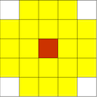
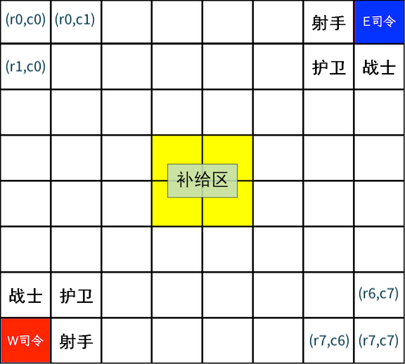

# 王国守卫战比赛规则

## 引言

此文档是"王国守卫战"的规则文档.

## 总述

"王国守卫战"是一款由玩家扮演国王指挥士兵在大陆上与敌人对决的AI策略游戏.
参战双方在同一场地内通过指挥不同种类的士兵厮杀以摧毁敌方基地来获得最终胜利.

## 基本概念

### 士兵

士兵一共有三个, 分别是骑兵、弓兵与步兵, 具体属性见下表:
兵种|攻击力|生命值|攻击范围|移动范围
:-:|:-:|:-:|:-:|:-:
骑兵|400|800||
弓兵|500(攻击步兵时\*2)|300||
步兵|200(攻击基地时\*3)|1800||

### 棋盘(战场)

如下图所示, 战斗场地大小为8\*8的棋盘. 玩家分为 East West（东西）两方, 其中West为先手. 左下角蓝色区块为蓝方基地所在位置, 右上角红色区块为红方基地所在位置. 基地的初始生命值为2000, 双方士兵初始位置如图所示.

### 回合制

比赛采用回合制.  
规定下面的流程是两个轮次(turn)，游戏开始后, 对战平台会重复执行直到游戏结束（达到60轮次或有一方基地被摧毁）.  

   1. 先手玩家(West)让所有士兵进行移动或攻击某个敌方目标.
   2. 对战平台进行盘面状态更新.
   3. 后手玩家(East)移动一个士兵或者让士兵进攻某个敌方目标. (注意: 后手玩家会获得刚刚更新的盘面状态)
   4. 对战平台进行盘面状态更新.

## 具体规则

### 士兵移动规则

参见[士兵属性](#士兵)表格中的"移动范围": 如果玩家希望移动士兵, 则士兵的终止范围必须包含在当前位置(棕色区块)所覆盖的移动范围内(黄色区块), 并且所移动的目标位置不可以存在双方的士兵或基地.

### 士兵攻击规则

参见[士兵属性](#士兵)表格中的"攻击范围": 士兵可以发起的攻击目标包括敌方士兵与基地. 当攻击目标位于士兵当前位置(棕色区块)所覆盖的攻击范围(黄色区块)时, 玩家可以指挥士兵对目标发起攻击, 发起攻击后, 被攻击的目标的生命值会减少发起进攻的士兵的攻击力对应的数值（依不同兵种有特殊加成规则）.

### 生命回复

若士兵在结束轮次时处在安全区（棋盘中央2\*2的黄色方块），可以使自身生命值增加50，同时让基地生命值增加20. 注意棋子生命值有上限（初始生命值），基地生命值没有上限.

### 士兵的死亡规则

在一个轮次中，士兵无论生命值如何均不会移出棋盘. 在一个轮次结束并进行生命回复之后，生命值小于等于0的士兵视为立即死亡并移出棋盘，之后不可再加入棋盘.

### 胜负判定

   1. 若有玩家基地生命值小于等于零, 则直接判负.
   2. 若有玩家进行非法操作, 直接判负. (非法操作包括但不限于: AI返回的士兵移动位置超出该士兵的移动范围、士兵攻击对象为空、士兵攻击友方)
   3. AI运行超时, 直接判负.
   4. 60轮次结束后, 总血量高者获胜.
   5. 60轮次结束后, 若总血量相同, AI总用时少者获胜.
   6. AI总用时以微秒为单位记录(`time.time_ns()`), 若仍一样, East（后手）获胜

## 编辑历史

+ 2024.4.15 创建此文档
+ 2024.4.20 更改
