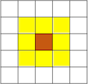
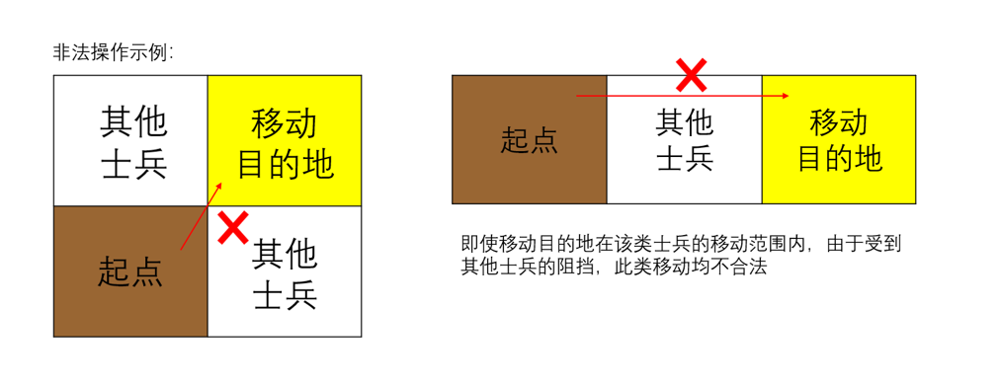

# 王国守卫战比赛规则

## 引言

此文档是"王国守卫战"的规则文档.

## 总述

"王国守卫战"是一款由玩家扮演国王指挥士兵在大陆上与敌人对决的AI策略游戏。 
参战双方在同一场地内通过指挥不同种类的士兵击杀敌军来获得最终胜利。

## 基本概念

### 士兵

士兵一共有四种, 分别是战士、射手、护卫与司令, 具体属性见下表:
兵种|攻击力|生命值|攻击范围|移动范围
:-:|:-:|:-:|:-:|:-:
战士**W**arrior|200|1000||
射手**A**rcher|250|700||
护卫**P**rotector|150|1400||
司令**C**ommander|-|1600|司令不能移动或攻击|-

### 棋盘(战场)

如下图所示, 战斗场地大小为8\*8的棋盘, 棋盘中央2*2的黄色方块为补给区。玩家分为红蓝两方（W/E）, 其中红方（W）为先手。左下角红色区块为红方司令所在位置, 右上角蓝色区块为蓝方（E）司令所在位置。双方士兵初始位置和位置标记方式如图：

### 回合制

比赛采用回合制，先手玩家（红W）进行第一轮次。 
规定下面的流程是一个轮次（turn），游戏开始后, 对战平台会重复执行轮次直到游戏结束。

   1. 玩家指定某个士兵进行操作，并指定移动目的地和攻击目的地，实现移动和攻击
   2. 对战平台进行盘面状态更新与生命值结算（次序为移动、回血、攻击）
   3. 对战平台进行[胜负判定](#胜负判定)，如果本轮次无法判定胜负，则进行下一轮次

## 具体规则

### 士兵移动规则

1. 参见[士兵属性](#士兵)表格中的"移动范围", 如果玩家希望移动士兵, 则士兵的终止范围必须包含在当前位置(棕色区块)所覆盖的移动范围内(黄色区块)
2. 移动时，需要考虑遮挡问题。即士兵只能沿水平或竖直方向移动, 不能斜线移动, 因此移动目的地和移动所经位置均不可以存在任何一方的士兵；如果存在多种路径, 士兵将优先选择没有遮挡的路径；如果任何路径都不能避免遮挡问题，则该移动不合法。示例如下：

### 士兵攻击规则

1. 参见[士兵属性](#士兵)表格中的"攻击范围", 士兵可以发起的攻击目标仅限于敌方士兵。当攻击目标位于士兵当前位置(棕色区块)所覆盖的攻击范围(黄色区块)时, 玩家可以指挥士兵对目标发起攻击, 且攻击时无需考虑遮挡问题
2. 发起攻击后, 被攻击的目标的生命值会减少发起进攻的士兵的攻击力对应的数值

### 补给区回血

任何士兵在轮次操作结束时处在补给区（棋盘中央2\*2的黄色方块），可以使自身生命值增加**25**，同时让己方司令生命值增加**25**。注意士兵生命值有上限（初始生命值），司令生命值**没有上限**

### 士兵的死亡规则

在一个轮次操作结束，进行盘面状态更新（先结算回血再结算攻击）后，生命值小于等于0的士兵视为立即死亡并移出棋盘，之后不可再加入棋盘

### 超时判定规则
对战平台会对每一轮次进行计时，运行时间达到0.2秒时，平台将给出warning提示；  
存在两种超时判定条件，触发任意一个，即判定为超时，两种标准分别为:
1. 存在1次运行时间超过1秒的轮次
2. 积累20次warning提示

### 胜负判定

   1. 若有玩家司令生命值小于等于零, 直接判负
   2. 若有玩家进行非法操作, 直接判负 (非法操作包括: 调用已经死亡的士兵, 士兵移动目的地超出该士兵的移动范围或超出棋盘, 移动路径存在士兵挡路, 攻击位置超出范围, 攻击位置无对方目标等)
   3. AI运行超时, 直接判负
   4. 100轮次结束后，司令生命值多者获胜
   5. 如果司令生命值相同, 所有士兵生命值总和多者获胜
   6. 若仍不能区分胜负，后手方（E）获胜

## 编辑历史

- 2024.4.15 创建此文档
- 2024.4.20 更新
- 2024.4.22 更新 by chbpku
- 2024.4.28 更新 by chbpku
