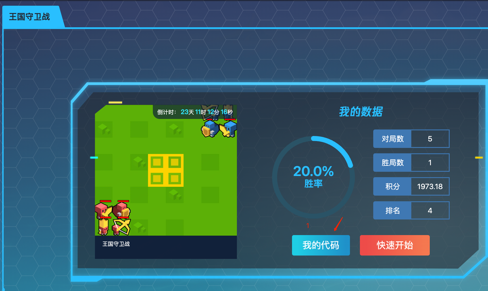
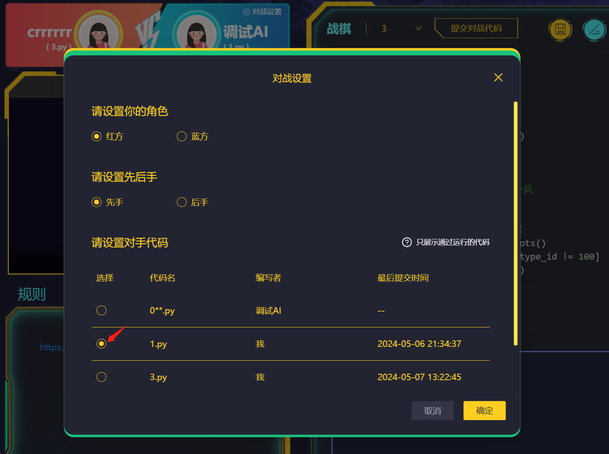

# 对战平台使用说明

对战入口：https://ai-arena.qq.com/arena-entry?seasonId=realmdemo

说明：
1. 首次使用需要注册
2. 权限暂未开放；在统一收集账号信息后，对战平台的权限将对全体同学开放

## 测试
1. 点击 “我的代码” - “去新增”，即可上传本组的对战代码
2. 点击 “运行代码”，开始测试。默认处于W方，与“调试AI”（E方）进行对战; “调试AI”为idiot_ai, 即在所用可行操作中随机选取操作
3. 如果代码存在错误，报错信息将于右下方 “Log 信息”区域呈现
4. 调试成功后，可查看对战的可视化过程和最终结果

## 指定两个代码进行对战
提交多个代码后，玩家可以手动设定对手策略，即指定两个代码进行对战
1. 点击“我的代码”-“编辑”（已上传）或“去新增”（未上传）-“提交对战代码”-“对战设置”，即可手动设定角色、先后手和对手代码（可选代码包括初始调试AI和过往上传的全部代码）
2. 点击“运行代码”后，对手设置将完成更改，并呈现可视化过程和最终结果

操作示意图：
    
    
    
 

## 匹配对手进行对战
1. 设置对战代码：点击“我的代码”-“设为对战代码”, 对战代码将用于主动发起对战或被动接受对战
2. 进行对战：点击“快速开始”-“开始对战”，系统将匹配对手，将本组代码与其他代码进行对战，并展示对战过程和结果
3. 查看：对战结束后，返回入口网页，即可查看历史对战数据，包括对战记录、积分等

